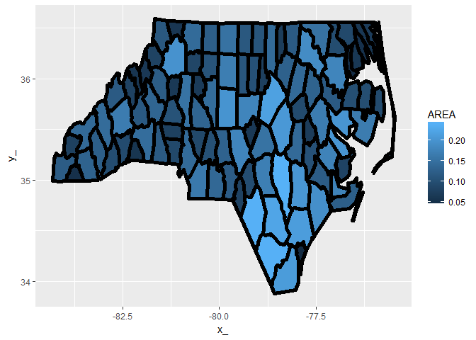
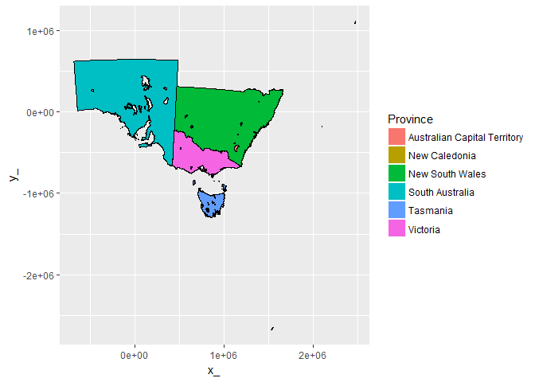
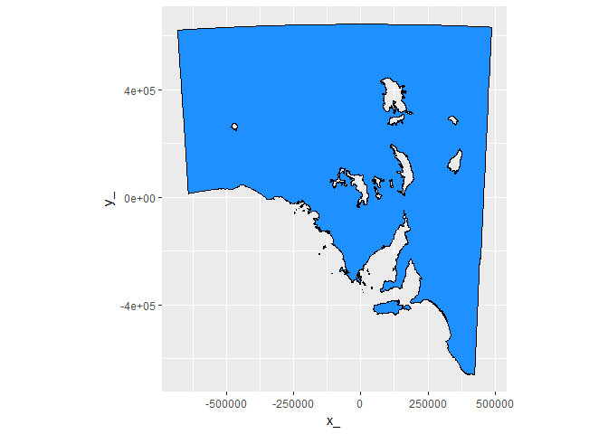

<!-- README.md is generated from README.Rmd. Please edit that file -->
sc
==

The goal of sc is to provide a general common form for complex multi-dimensional data.

See the [proposal.md](proposal.md).

This package is intended to provide support to the `common form` approach described here. There's very little in the package yet, but see these projects that are informed by this approach.

-   **rbgm** - [Atlantis Box Geometry Model](https://github.com/AustralianAntarcticDivision/rbgm), a "doubly-connected edge-list" form of linked faces and boxes in a spatially-explicit 3D ecosystem model
-   **rangl** - [Primitives for Spatial data](https://github.com/r-gris/rangl), a generalization of GIS forms with simple 3D plotting
-   **spbabel** - [Translators for R Spatial](https://github.com/mdsumner/spbabel), tools to convert from and to spatial forms, provides the general decomposition framework for branches, used by `rangl`
-   **sfct** - [Constrained Triangulation for Simple Features](https://github.com/r-gris/sfct) tools to decompose `simple features` into (non-mesh-indexed) primitives.

Design
------

Currently `BRANCH()` is the main function to decompose simple features objects.

There are decomposition functions for lower-level `sf` objects organized as `sc_branch`, `sc_coord`, and `sc_object`. `sc_branch` does all the work, building a simple map of all the parts and the vertex count. This is used to classify the vertex table when it is extracted, which makes the unique-id management for branch-vertex normalization much simpler than it was in `gris` or `rangl`.

Example
-------

``` r
library(sf)
#> Linking to GEOS 3.5.0, GDAL 2.1.1, proj.4 4.9.3
## a MULTIPOLYGON layer
nc = st_read(system.file("shape/nc.shp", package="sf"))
#> Reading layer `nc' from data source `C:\Users\michae_sum\R\win-library\3.3\sf\shape\nc.shp' using driver `ESRI Shapefile'
#> converted into: MULTIPOLYGON
#> Simple feature collection with 100 features and 14 fields
#> geometry type:  MULTIPOLYGON
#> dimension:      XY
#> bbox:           xmin: -84.32385 ymin: 33.88199 xmax: -75.45698 ymax: 36.58965
#> epsg (SRID):    4267
#> proj4string:    +proj=longlat +datum=NAD27 +no_defs
```

The common form is the entity tables, objects, branches, vertices and a link table to allow de-duplication of shared vertices. Currently this de-duplication is done on all coordinate fields, but for most applications it will usually be done only in X-Y.

``` r
library(sc)
(bmodel <- BRANCH(nc))
#> $object
#> # A tibble: 100 × 15
#>     AREA PERIMETER CNTY_ CNTY_ID        NAME   FIPS FIPSNO CRESS_ID BIR74
#>    <dbl>     <dbl> <dbl>   <dbl>      <fctr> <fctr>  <dbl>    <int> <dbl>
#> 1  0.114     1.442  1825    1825        Ashe  37009  37009        5  1091
#> 2  0.061     1.231  1827    1827   Alleghany  37005  37005        3   487
#> 3  0.143     1.630  1828    1828       Surry  37171  37171       86  3188
#> 4  0.070     2.968  1831    1831   Currituck  37053  37053       27   508
#> 5  0.153     2.206  1832    1832 Northampton  37131  37131       66  1421
#> 6  0.097     1.670  1833    1833    Hertford  37091  37091       46  1452
#> 7  0.062     1.547  1834    1834      Camden  37029  37029       15   286
#> 8  0.091     1.284  1835    1835       Gates  37073  37073       37   420
#> 9  0.118     1.421  1836    1836      Warren  37185  37185       93   968
#> 10 0.124     1.428  1837    1837      Stokes  37169  37169       85  1612
#> # ... with 90 more rows, and 6 more variables: SID74 <dbl>, NWBIR74 <dbl>,
#> #   BIR79 <dbl>, SID79 <dbl>, NWBIR79 <dbl>, object_ <chr>
#> 
#> $branch
#> # A tibble: 108 × 4
#>    island_ ncoords_          branch_          object_
#>      <chr>    <int>            <chr>            <chr>
#> 1        1       27 67d386930d20cb30 a803a4706066f737
#> 2        1       26 a64cb88c6a7cf6c2 4e67e7400a7bab37
#> 3        1       28 c8ec4d05327274fc f40a3f7317c72ced
#> 4        1       26 d0b817980acedd04 5be425b4ab83a94a
#> 5        2        7 c81c822a9b5bb2ab 5be425b4ab83a94a
#> 6        3        5 2530158bc54eaa18 5be425b4ab83a94a
#> 7        1       34 e1597fcdbf95969e f3d4d9c290941385
#> 8        1       22 816d6033394ea531 f5bd4efca4403065
#> 9        1       24 ad48115638add180 96f2d2f4840960ce
#> 10       1       17 9c288e89bcd85f22 3abb703fbe5e56f0
#> # ... with 98 more rows
#> 
#> $vertex
#> # A tibble: 1,255 × 3
#>           x_       y_          vertex_
#>        <dbl>    <dbl>            <chr>
#> 1  -81.47276 36.23436 801b09790de7b8a3
#> 2  -81.54084 36.27251 6423922f0d516250
#> 3  -81.56198 36.27359 a2d023ad3ead2c41
#> 4  -81.63306 36.34069 9bac4e55e83215cc
#> 5  -81.74107 36.39178 162885d45edd7d69
#> 6  -81.69828 36.47178 82e7588eb5f239fc
#> 7  -81.70280 36.51934 17a1732b36dc1704
#> 8  -81.67000 36.58965 a42e325ffac0ed35
#> 9  -81.34530 36.57286 e8025d7330d337e8
#> 10 -81.34754 36.53791 7ff43c3cb9b787e0
#> # ... with 1,245 more rows
#> 
#> $branch_link_vertex
#> # A tibble: 2,529 × 2
#>             branch_          vertex_
#>               <chr>            <chr>
#> 1  67d386930d20cb30 801b09790de7b8a3
#> 2  67d386930d20cb30 6423922f0d516250
#> 3  67d386930d20cb30 a2d023ad3ead2c41
#> 4  67d386930d20cb30 9bac4e55e83215cc
#> 5  67d386930d20cb30 162885d45edd7d69
#> 6  67d386930d20cb30 82e7588eb5f239fc
#> 7  67d386930d20cb30 17a1732b36dc1704
#> 8  67d386930d20cb30 a42e325ffac0ed35
#> 9  67d386930d20cb30 e8025d7330d337e8
#> 10 67d386930d20cb30 7ff43c3cb9b787e0
#> # ... with 2,519 more rows
#> 
#> attr(,"class")
#> [1] "BRANCH" "sc"    
#> attr(,"join_ramp")
#> [1] "object"             "branch"             "branch_link_vertex"
#> [4] "vertex"
```

Prove that things work by round-tripping to the BRANCH model and onto the old fortify approach for `ggplot2`.

``` r
inner_cascade <- function(x) {
  tabnames <- sc:::join_ramp(x)
  tab <- x[[tabnames[1]]]
  for (ni in tabnames[-1L]) tab <- dplyr::inner_join(tab, x[[ni]])
  tab
}

## this just joins everything back together in one big fortify table
library(dplyr)
#> 
#> Attaching package: 'dplyr'
#> The following objects are masked from 'package:stats':
#> 
#>     filter, lag
#> The following objects are masked from 'package:base':
#> 
#>     intersect, setdiff, setequal, union
tab <- bmodel  %>% inner_cascade()
#> Joining, by = "object_"
#> Joining, by = "branch_"
#> Joining, by = "vertex_"

library(ggplot2)
ggplot(tab) + aes(x = x_, y = y_, group = branch_) + 
  geom_polygon(aes(fill = AREA)) +  geom_path(lwd = 2, col = "black") 
```



What about polygons with holes and lots of tiny complicated parts.

``` r
data("inlandwaters")

iw <- BRANCH(inlandwaters)

str(iw)
#> List of 4
#>  $ object            :Classes 'tbl_df', 'tbl' and 'data.frame':  6 obs. of  3 variables:
#>   ..$ ID      : int [1:6] 103841 103842 103843 103846 103847 103848
#>   ..$ Province: chr [1:6] "Australian Capital Territory" "New Caledonia" "New South Wales" "South Australia" ...
#>   ..$ object_ : chr [1:6] "0354d9213321bd0d" "5415a35e754c6393" "fa30a4fa483bf377" "215fb30453740906" ...
#>  $ branch            :Classes 'tbl_df', 'tbl' and 'data.frame':  189 obs. of  4 variables:
#>   ..$ island_ : chr [1:189] "1" "1" "1" "1" ...
#>   ..$ ncoords_: int [1:189] 280 27 7310 68 280 88 162 119 51 71 ...
#>   ..$ branch_ : chr [1:189] "496fb7cdadb4e270" "adad474080626ec7" "b11cb677dee47936" "fb9462649549c67c" ...
#>   ..$ object_ : chr [1:189] "0354d9213321bd0d" "5415a35e754c6393" "fa30a4fa483bf377" "fa30a4fa483bf377" ...
#>  $ vertex            :Classes 'tbl_df', 'tbl' and 'data.frame':  30835 obs. of  3 variables:
#>   ..$ x_     : num [1:30835] 1116371 1117093 1117172 1117741 1117629 ...
#>   ..$ y_     : num [1:30835] -458419 -457111 -456893 -456561 -455510 ...
#>   ..$ vertex_: chr [1:30835] "b1897dc728ff48f3" "cfcac520ae0d4653" "ba5f21d2f8d645d4" "169083dd1abdf03f" ...
#>  $ branch_link_vertex:Classes 'tbl_df', 'tbl' and 'data.frame':  33644 obs. of  2 variables:
#>   ..$ branch_: chr [1:33644] "496fb7cdadb4e270" "496fb7cdadb4e270" "496fb7cdadb4e270" "496fb7cdadb4e270" ...
#>   ..$ vertex_: chr [1:33644] "b1897dc728ff48f3" "cfcac520ae0d4653" "ba5f21d2f8d645d4" "169083dd1abdf03f" ...
#>  - attr(*, "class")= chr [1:2] "BRANCH" "sc"
#>  - attr(*, "join_ramp")= chr [1:4] "object" "branch" "branch_link_vertex" "vertex"

tab <- iw  %>% inner_cascade()
#> Joining, by = "object_"
#> Joining, by = "branch_"
#> Joining, by = "vertex_"

library(ggplot2)
ggplot(tab) + aes(x = x_, y = y_, group = branch_) + 
  ggpolypath::geom_polypath(aes(fill = Province)) +  geom_path(col = "black") 
```



``` r

ggplot(tab %>% filter(Province == "South Australia")) + aes(x = x_, y = y_, group = branch_) + 
  ggpolypath::geom_polypath(fill = "dodgerblue") +  geom_path(col = "black") + coord_fixed()
```


